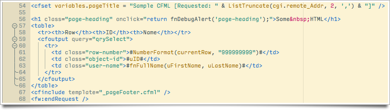
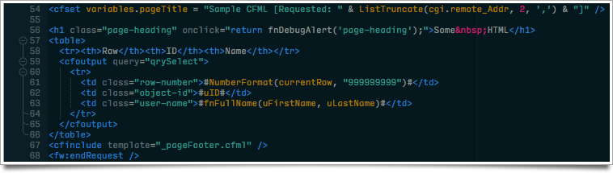
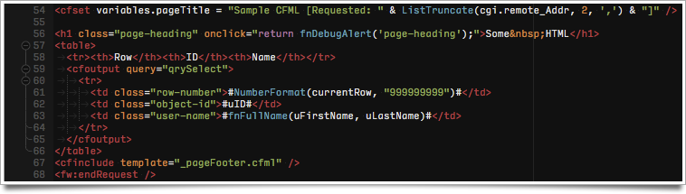
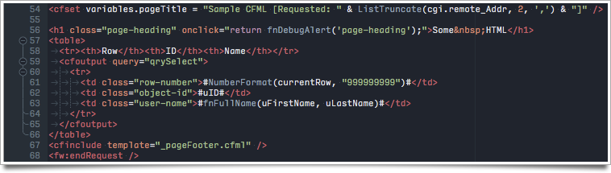
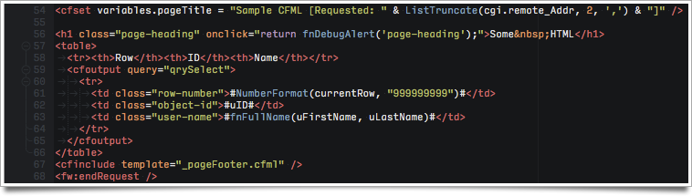
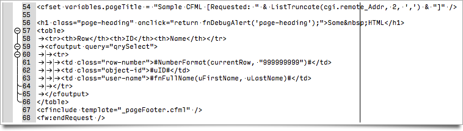
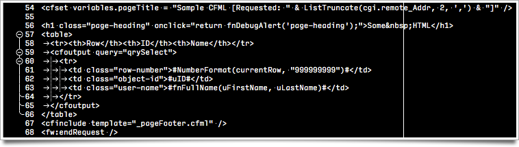

# komodo-color-schemes
A small collection of color schemes I have created, primarily for my own use, for [ActiveState Komodo IDE/Edit](http://komodoide.com/).

## Solaron-Light and -Dark
Solaron is a pair of schemes based on [Ethan Schoonover's Solarized palette](http://ethanschoonover.com/solarized). In most areas, these schemes stay true to that palette, but there are a few areas where I have intentionally differed for either greater or lesser contrast (e.g., choosing a color that is the mathematical midpoint between two greys within the Solarized palette) and based on differences between how Komodo tokenizes languages and renders colors (compared to other editors such as TextMate, Sublime, and Atom). I've done a bit of tuning within the schemes, trying to configure colors for consistency across syntaxes for languages and filetypes I frequently work in, and based on my own preferences and habits.

## Base16r-Default-Dark, -Ocean-Dark, and -Tomorrow-Dark
Base16r is a set of schemes based on some of [Chris Kempson's Base16 palettes](https://github.com/chriskempson/base16), with the "r" in the name to differentiate these from other Base16-based schemes. As with Solaron, above, these stay true in most areas to their respective palettes, but I have intentionally tweaked each of them in a few areas for consistency with each other and/or for different levels of contrast.

## Minimal-Light and -Dark
Minimal is not a pair of schemes I would ever use for "real work". I have found that when I start working on a new color scheme I like to have a clean slate where I know there aren't odd colors left hanging around in corners of the scheme (which can easily happen if I start with an existing theme). Minimal is my clean slate...

## Additional Notes
### Typefaces
All of these schemes are configured to use [David Jonothan Ross's Input Mono](http://input.fontbureau.com/) typeface. If you don't have that face installed, you will almost certainly want to tweak any of these schemes to use your preferred typeface.

### Installation
Installing color schemes in Komodo is as simple as downloading the `.ksf` file, then dragging and dropping it on the running Komodo program. Alternatively, download the `.ksf` file and move it into the `./schemes/` folder within your Komodo profile folder, then restart Komodo. See [this post](http://forum.komodoide.com/t/important-file-locations/489) from the Komodo forums for the location of Komodo profile folders on various operating systems.
